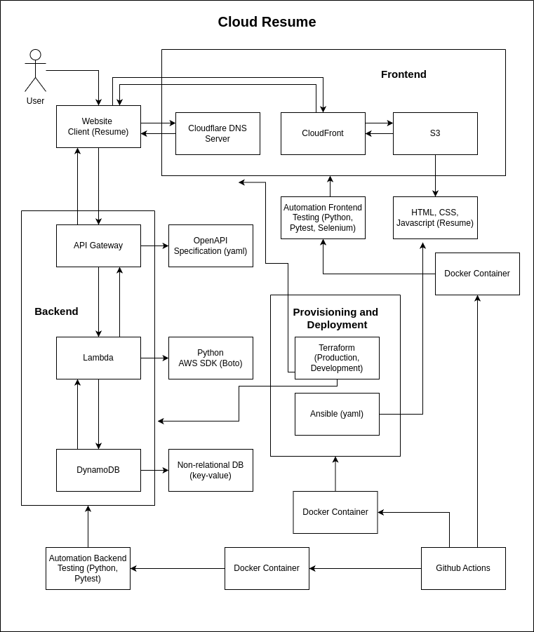

# Cloud Resume

- Project Initiative: https://cloudresumechallenge.dev/
- Resume Link: https://resume.avivilloz.com/

# Technologies Used:

- Front-end: HTML, CSS, Javascript, S3, CloudFront
- Back-end: Python, Lambda, API Gateway, OpenAPI, DynamoDB
- AWS services: S3, API Gateway, DynamoDB, CloudFront, Lambda, CloudWatch
- IaC: Terraform
- Configuration: Ansible
- Automation/Scripting: Bash
- Testing: Python, Pytest, Selenium
- Debugging: CloudWatch
- CI/CD: GitHub Actions
- Containerization: Docker 
- DNS: Cloudflare

# What's next:

- Create infrastructure in Azure and GCP

# Design:

